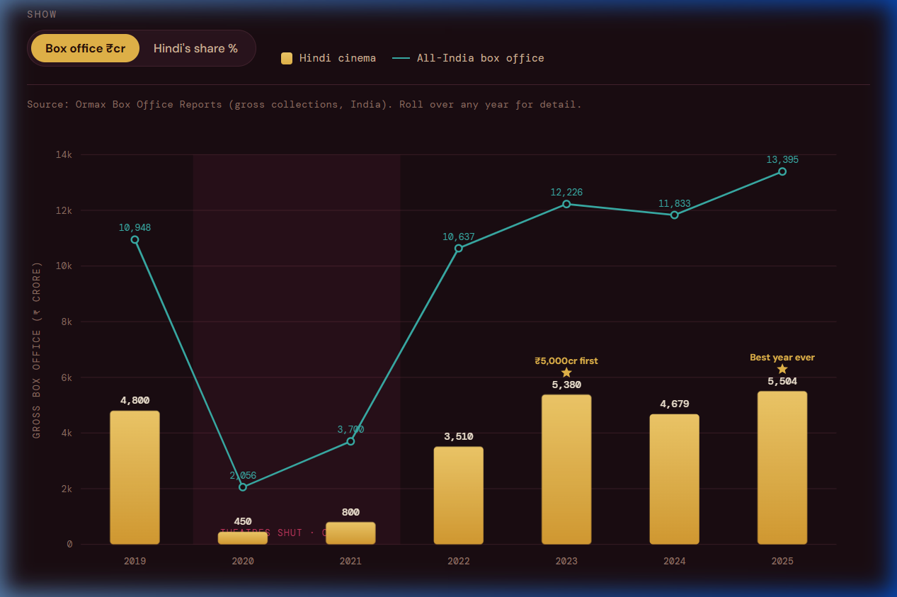
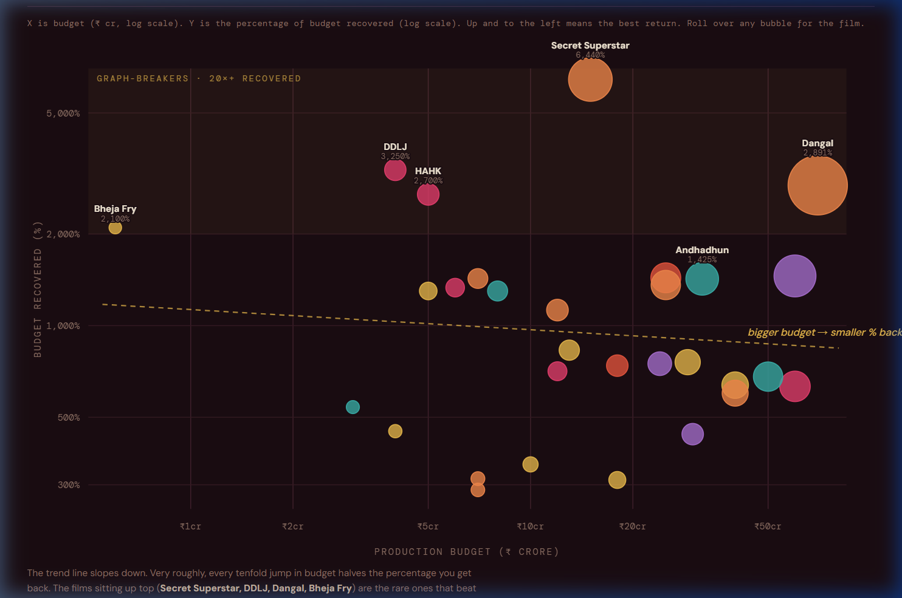
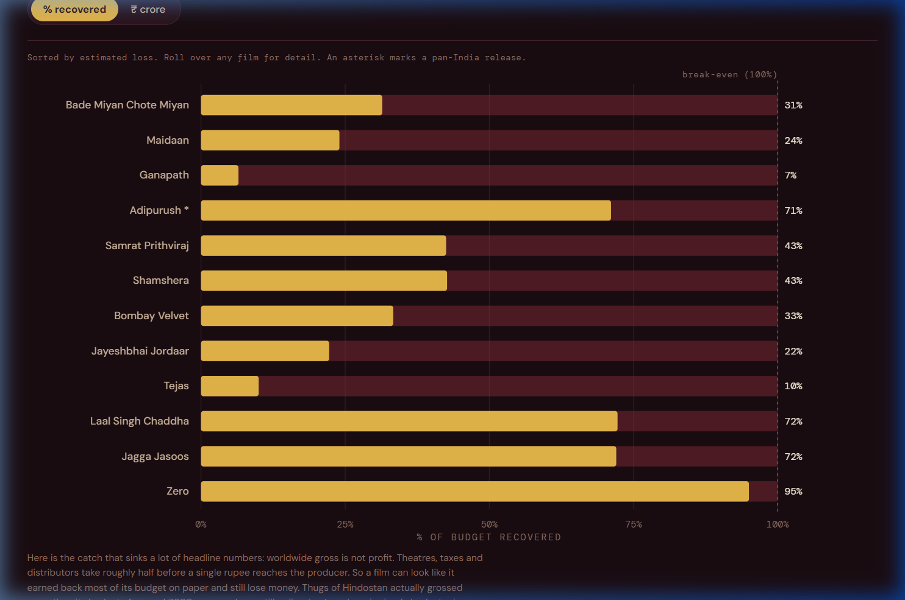

# The Business of Bollywood

An interactive data story about the money behind Hindi cinema. Three charts, one scrollable page, no frameworks and no build step. Just open it in a browser.

It started as a simple question. Information Is Beautiful once mapped the most successful Hollywood movie of all time by return on investment instead of raw gross, and the answer looked nothing like the usual blockbuster list. I wanted to see what the same lens does to Bollywood. The answer turned out to be a good story, so it grew into three.

## Visual Insights

### 1. Bollywood by the years
Annual Hindi cinema box office from 2019 to 2025, with the all India total drawn behind it as a line. You can see the pandemic wipe out most of the business in 2020, a slow recovery led by South Indian films, and a genuine record set in 2025.


### 2. Percent of budget recovered
Every film plotted by what it cost against how much of that cost it earned back, on log-log scales, coloured by genre and sized by gross. The pattern is blunt: the smaller the budget, the bigger the percentage return.


#### Interpretation Guide
- **Logarithmic Scales**: Both axes are plotted using logarithmic values (base 10). This choice is critical: it prevents extreme successes (such as *Secret Superstar* which recovered over 6000% of its budget) from squishing the remaining movies into a single unreadable cluster at the bottom.
- **Bubble Sizing**: The area of each movie node represents its worldwide gross box office collections. Larger bubbles represent high-grossing blockbusters, while smaller bubbles indicate lower overall revenue.
- **Color-Coding**: Films are color-coded by their primary genre using a premium dark-background friendly HSL palette:
  - **Comedy**: Gold/Yellow (`#e8b84b`)
  - **Romance**: Rose/Pink (`#e63e6d`)
  - **Drama**: Saffron/Orange (`#f2884b`)
  - **Thriller**: Teal (`#3aafa9`)
  - **Action**: Coral/Red (`#e8553e`)
  - **Horror-Comedy**: Lavender/Purple (`#a96fd0`)


### 3. Biggest losers
The other side of the ledger. A ranked list of the Hindi films that recovered the least of their cost, with gold showing what came back and red showing what did not.


---

## What is inside

**1. Bollywood by the years.** A toggle switches from rupees to Hindi's share of the whole market, which tells a quieter story about who actually drove the comeback.

**2. Percent of budget recovered.** A trend line makes it obvious, and the genre filter lets you ask which kinds of films punch above their weight.

**3. Biggest losers.** A toggle flips between percentage recovered and rupees lost.

## Live demo

If you enable GitHub Pages on this repo (Settings, then Pages, then deploy from the main branch root), the page will be live at:

```
https://YOUR-USERNAME.github.io/bollywood-data-story/
```

## Run it locally

There is nothing to install. Clone the repo and open the file.

```bash
git clone https://github.com/YOUR-USERNAME/bollywood-data-story.git
cd bollywood-data-story
open index.html        # macOS
# or just double click index.html
```

If you want a local server (handy for some browsers):

```bash
python3 -m http.server 8000
# then visit http://localhost:8000
```

### Local Troubleshooting
- **Port already in use**: If Python complains that port 8000 is occupied, launch the server on an alternate port (e.g. `python3 -m http.server 8080`).
- **Browser Caching**: If updates to data don't appear in the browser, perform a hard refresh (`Ctrl + F5` on Windows or `Cmd + Shift + R` on macOS) to clear cached scripts.
- **Python missing**: If `python3` isn't recognized, try `python -m http.server 8000` or double-click `index.html` to load it via the `file://` protocol.


## How it is built

Plain HTML, CSS and vanilla JavaScript. The charts are hand drawn as SVG, so there are no chart libraries, no npm install and no dependencies to break. Each of the three charts runs in its own isolated scope on the page, so their toggles and filters never interfere with each other. Fonts load from Google Fonts. Everything else is in one file.

## The data

The raw numbers live in the `data` folder as CSV so anyone can check or reuse them:

- `box_office_by_year.csv`
- `budget_recovered.csv`
- `biggest_losers.csv`

### Adding or Updating Movie Data
If you want to add a movie to the dataset (for example, to add it to the scatter plot in Chart 2):
1. Open [data/budget_recovered.csv](data/budget_recovered.csv) in a text editor or spreadsheet program.
2. Add a new row at the bottom with the following comma-separated values:
   - `film`: Movie name (e.g. `My New Blockbuster`)
   - `year`: Release year (e.g. `2026`)
   - `budget_cr`: Production budget in ₹ crore
   - `worldwide_gross_cr`: Worldwide gross box office in ₹ crore
   - `genre`: Primary genre matching one of the existing keys (`Romance`, `Comedy`, `Drama`, `Thriller`, `Action`, `Horror-Comedy`)
   - `pct_recovered`: Percentage calculated as `(worldwide_gross_cr / budget_cr) * 100` (e.g. `250` for 250% recovery)
3. If the movie is also an outlier with a massive budget loss, you can add it to [data/biggest_losers.csv](data/biggest_losers.csv) in a similar fashion.
4. Note that after updating the CSV, you will need to add the movie's dictionary node to the matching JavaScript `DATA` array inside `index.html` to update the rendered SVG charts.


`data/SOURCES.md` explains where each figure comes from and, just as important, where the soft spots are. Indian box office data is messy. Budgets and grosses are rarely audited and trade sources often disagree, so treat everything here as a careful estimate rather than a final ledger. The short version of the caveats:

- Worldwide gross is not profit. Theatres, taxes and distributors take roughly half before the producer sees a rupee.
- Budgets exclude marketing, which can cost as much again.
- A few outliers (Dangal, Secret Superstar, Andhadhun) are lifted by huge runs in China.

## Browser Compatibility

This data story is built using modern web standards. It has been tested and verified across:
- **Google Chrome** (v80+)
- **Mozilla Firefox** (v75+)
- **Apple Safari** (v13+)
- **Microsoft Edge** (v80+)

### Accessibility Design
- **SVG Scaling**: Charts use SVG `viewBox` coordinates, resizing cleanly on mobile viewports.
- **Prefers-Reduced-Motion**: Respects user browser preference setting `prefers-reduced-motion: reduce` by disabling bar-chart grow animations.
- **Keyboard Navigation**: Buttons and toggle chips are semantic `<button>` tags with visible focus outlines (`focus-visible`) for screen readers and keyboard-only users.


## Credit

Inspired by the Information Is Beautiful piece on the most successful Hollywood movie of all time. Box office figures lean heavily on the Ormax year end reports, with per film numbers cross checked across Wikipedia, Box Office India, Koimoi and Sacnilk.

## License

MIT. Use it, fork it, improve it. If you build on the data, a link back is appreciated.

Built by Jayshil's Analytics.
